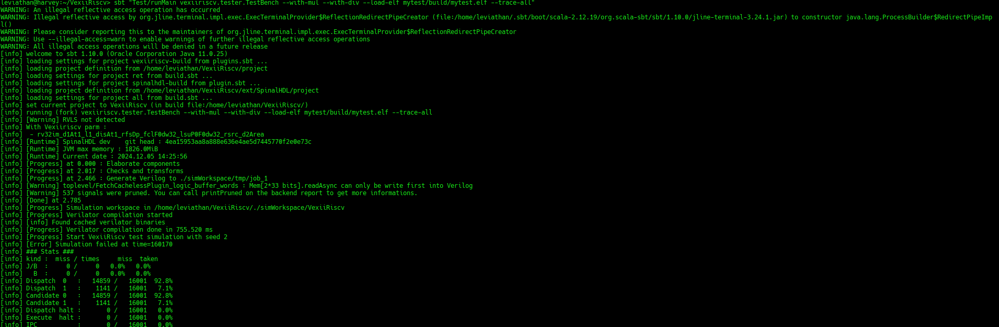
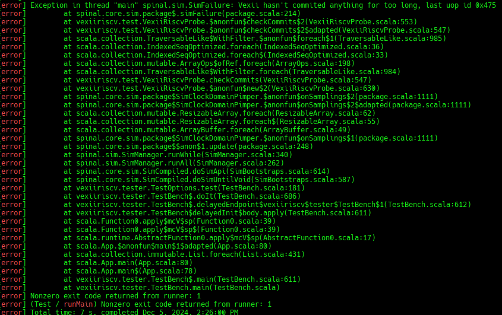
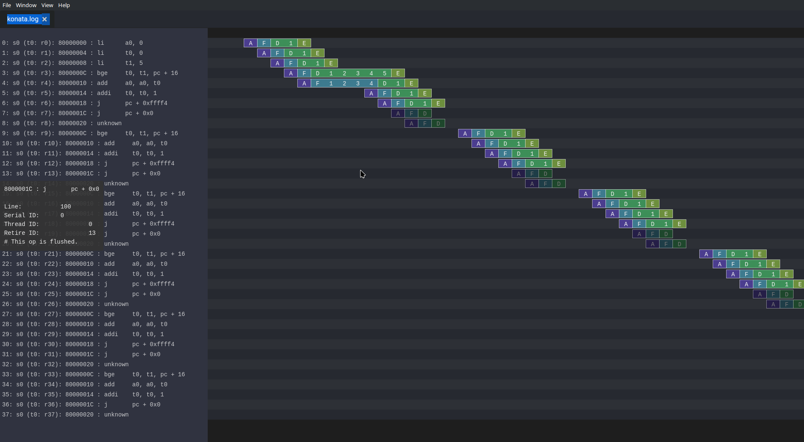

=======================
Self Contained Tutorial
=======================

In this tutorial you will:

* Write some assembly
* Assemble (compile) it
* Add a bug
* Run your code in a simulator
* Debug the bug
* Learn how to show important signals from the wave
* Fix the bug

Tooling
=======

You have two options for getting start:

* You can use the Docker image with all the dependencies preinstalled
* You can use the How To Use guide on how to install all the stuff you need locally on your machine

Assembler
=========

Looking at examples
-------------------

In case you haven't done so, you should bring your repo up to speed and init+update all the submodules

.. code-block:: bash

    cd VexiiRiscv
    git pull
    git submodule update --init --recursive 

After that you can find many test programes in `ext/NaxSoftware/baremetal`, mostly written in assembly. For instance : 

- pmp : is used to test the RISC-V PMP, which allows the machine mode to restrict memory accesses of the supervisor/user mode to specific ranges (Physical Memory Protection)
- simdAdd : is used to test a custom instruction which implements 4 bytes adder in a single instruction
- machine_vexii : is used to test most of the RISC-V machine mode privilegied spec, as for instance, unaligned memory load exception, ...

Writting tests in assembly is often the only viable way to test low level features for a few reasons : 

- It avoid all the noise which would come from C/C++ languages. 
- It allow to restrict the features of the CPU being used in the tests, which is very usefull for bring up.
- It allows to create very precise sequances of instruction, allowing you to trigger specific corner cases

Write the assembler code
-------------------------

So first of all, create a folder in your repository root ("/work" inside the Docker environment, or otherwisde simply VexiiRiscv. The folder you cloned the repository into) called "mytest"... basically

.. code-block:: bash

    cd VexiiRiscv
    mkdir -p mytest/src
    cd mytest

or in Docker

.. code-block:: bash

    cd /work
    mkdir -p mytest/src
    cd mytest
    

then create an assembler file inside the src folder called "crt.S" containing the following code

.. code-block:: nasm

    .option arch, +zicsr

    .global _start
    _start:
      li x1, 42 // Write the value 42 in the register x1

Build the assembler Code
------------------------

Now, it's time to create a GNU make file, using the NaxSoftware infrastructure,
so that we can turn our assembly code.

In the same mytest folder as above create a Makefile file containing the following

.. code-block:: make

    PROJ_NAME=mytest
    STANDALONE=../ext/NaxSoftware/baremetal
    include ../ext/NaxSoftware/baremetal/common/asm.mk

After running make in your bash shell respectively Cygwin shell (assuming you have installed everything),
you should now be able to find a folder named "build", containing a bin file, and asm file and most importantly
the ELF and map file.

.. code-block::

    leviathan@harvey:~/VexiiRiscv/mytest> ls build/
    mytest.asm  mytest.bin  mytest.elf  mytest.map

Initial run (Error)
-------------------

In order to run the assembly code we just made, we have to tell sbt to load our ELF file into the VexiiRiscv simulator by running the following command in the root source folder (/work respectively VexiiRiscv)

.. code-block:: bash

    cd ..
    sbt "Test/runMain vexiiriscv.tester.TestBench --with-rvm --allow-bypass-from=0 --load-elf mytest/build/mytest.elf --trace-all"

Here are what the options are for : 

- --with-rvm : Will turn on the RISC-V RVM extentions, allowing the exection of mul/div instruction.
- --allow-bypass-from=0 : Will enable the execute pipeline to forward results from the ALU back to new instruction before they commited, 
  so you can execute ALU instruction back to back, even when they depend on each others.
- --load-elf : This will ask the testbench to load the simulated memory with the content of the elf file before the CPU stats. 
  Additionaly, if the testbench detect that the CPU reached the pass/fail symbols of the elf file, it will end the simulation with a success/failure event.
- --trace-all : This will ask the simulation to capture a whole set of simulation traces that you can find in `simWorkspace/VexiiRiscv/test`, including the simulation waveform (wave.fst),
  a representation of the CPU pipeline status (konata.log).

Now it's running

But... ooopsie. It failed.

**Question:** Why??

**Answer** The CPU is locked into a illegal instruction exception loop of doom.

Here is the full scénario : 

- Once the CPU had executed `li x1, 42`, it then reach a portion of memory which isn't loaded with code but instead has a random value (the testbench is designed that way). 
- So it is very likely that the CPU try to execute a portion of memory which isn't reconized as an instruction, which produce a `illegal instruction exception`.
- This results into the CPU jumping to its trap vector (mtvec).
- This trap vector being initialized by the CPU reset to 0, will make the CPU jump/trap to PC=0
- At PC=0 there is aswell some random values, which likely will produce another `illegal instruction exception`, again and again, forever.
- Then, the testbench detect that the CPU isn't doing any `commit` anymore (forward progress) and call it a failure.

Fixing the Error
----------------

We can fix this error quickly by adding those two additional lines to our assembler file

.. code-block:: nasm
    
    pass:
      j pass

Which results in the following code

.. code-block:: nasm

    .option arch, +zicsr

    .global _start
    _start:
      li x1, 42 // Write the value 42 in the register x1
    pass:
      j pass   

After that we run the make command again.

Now the simulation won't fail anymore, and exit gracfully, as the testbench will detect that the CPU reached the `pass` symbol.

However, an endless loop which doesn't anything isn't very useful.

The assembler "hello world"
---------------------------

Since we can't really print out a "hello world" in this context because we're simulating a CPU
and the execution of assembler code on it, we go for the next best thing: A for loop

.. code-block:: c

    uint32_t sum = 0;
    
    for(int i = 0; i<5; i++) {
        sum = sum + i;
    }

As RISC-V assembly this looks like that:

.. code-block:: nasm

    .option arch, +zicsr

    .global _start
    _start:

        addi a0, zero, 0 # Initialize sum

        addi t0, zero, 0 # Counter with start value
        addi t1, zero, 5 # Counter with start value

    sum_loop:
        bge t0, t1, pass # i == 5
        add a0, a0, t0
        addi t0, t0, 1
        j sum_loop

    pass:
        j pass
        
Also, note that if you are interrested into more C to assembly comparison, you can use the Compiler Explorer tool. Here is an example : 

https://godbolt.org/#g:!((g:!((g:!((h:codeEditor,i:(filename:'1',fontScale:14,fontUsePx:'0',j:1,lang:___c,selection:(endColumn:2,endLineNumber:7,positionColumn:2,positionLineNumber:7,selectionStartColumn:2,selectionStartLineNumber:7,startColumn:2,startLineNumber:7),source:'int+miaou()%7B%0A++++int+count+%3D+1000%3B%0A++++while(count+!!%3D+0)%7B%0A++++++++asm(%22nop%22)%3B%0A++++++++count--%3B%0A++++%7D%0A%7D'),l:'5',n:'0',o:'C+source+%231',t:'0')),k:44.29215489283432,l:'4',n:'0',o:'',s:0,t:'0'),(g:!((h:compiler,i:(compiler:rv32-cgcctrunk,filters:(b:'0',binary:'1',binaryObject:'0',commentOnly:'0',debugCalls:'1',demangle:'0',directives:'0',execute:'1',intel:'0',libraryCode:'0',trim:'1',verboseDemangling:'0'),flagsViewOpen:'1',fontScale:14,fontUsePx:'0',j:2,lang:___c,libs:!(),options:'-O3',overrides:!(),selection:(endColumn:5,endLineNumber:10,positionColumn:5,positionLineNumber:10,selectionStartColumn:5,selectionStartLineNumber:10,startColumn:5,startLineNumber:10),source:1),l:'5',n:'0',o:'+RISC-V+(32-bits)+gcc+(trunk)+(Editor+%231)',t:'0')),k:55.707845107165674,l:'4',n:'0',o:'',s:0,t:'0')),l:'2',n:'0',o:'',t:'0')),version:4     

Looking at the pipeline
-----------------------

Opening the pipeline trace in Konata, we can see that it goes five times through the loop.

There you go. Our i < 5 condition was successfully executed

C code "hello world" (literally)
=================================

Here's a simple example how you can use C and sim_putchar for printing out stuff directly through the simulation environment, allowing you to output debug messages from within the firmware you're developing.

Write the C code
-----------------

So first of all, create a folder in your repository root ("/work" inside the Docker environment, or otherwisde simply VexiiRiscv. The folder you cloned the repository into) called "mytest"... basically

.. code-block:: bash

    cd VexiiRiscv
    mkdir -p helloworld/src
    cd helloworld

or in Docker

.. code-block:: bash

    cd /work
    mkdir -p helloworld/src
    cd helloworld
    
Create a file in src, called main.c

The content of src/main.c should look like that:

.. code-block:: c

    #include <sim.h>

    void main(){
        for(int i=0;i<10;i++) {
            char *str = "hello world";
            while(*str) sim_putchar(*str++);
        }
    }

Compiling the Code
------------------

Now, it's time to create a GNU make file, using the NaxSoftware infrastructure,
so that we can turn our c code into an ELF file which we can load in the simulator.

In the same helloworld folder as above create a Makefile file containing the following

.. code-block:: make

    PROJ_NAME=helloworld
    DEBUG=yes
    BENCH=no
    STANDALONE=../ext/NaxSoftware/baremetal
    SRCS =  $(wildcard src/*.c) \
            $(wildcard src/*.cpp) \
            $(wildcard src/*.S) \
            ${STANDALONE}/common/start.S
    include ../ext/NaxSoftware/baremetal/common/app.mk

After running make in your bash shell respectively Cygwin shell (assuming you have installed everything),
you should now be able to find a folder named "build", containing a bin file, and asm file and most importantly
the ELF and map file.

.. code-block::

    leviathan@harvey:~/VexiiRiscv/helloworld> make
    CC src/main.c
    CC ../ext/NaxSoftware/baremetal/common/start.S
    LD helloworld
    /opt/riscv/lib/gcc/riscv64-unknown-elf/13.2.0/../../../../riscv64-unknown-elf/bin/ld: warning: build/helloworld.elf has a LOAD segment with RWX permissions
    Memory region         Used Size  Region Size  %age Used
                 ram:        4848 B       256 KB      1.85%
    leviathan@harvey:~/VexiiRiscv/helloworld> ls
    build  Makefile  src
    leviathan@harvey:~/VexiiRiscv/helloworld> ls build/
    helloworld.asm  helloworld.bin  helloworld.elf  helloworld.map  home

Compilation error
-----------------

There might be a compilation error going somewhat like that

.. code-block::

    leviathan@harvey:~/VexiiRiscv/helloworld> make
    CC src/fix.S
    CC ../ext/NaxSoftware/baremetal/common/start.S
    ../ext/NaxSoftware/baremetal/common/start.S: Assembler messages:
    ../ext/NaxSoftware/baremetal/common/start.S:55: Error: unrecognized opcode `csrc mstatus,x1', extension `zicsr' required
    ../ext/NaxSoftware/baremetal/common/start.S:57: Error: unrecognized opcode `csrs mstatus,x1', extension `zicsr' required

This happens because newer builds of the RISC-V toolchain have this feature disabled by default now and you've got to manually enable it,
which can easily be achieved by adding the following on line 1 of ext/NaxSoftware/baremetal/common/start.S

.. code-block:: nasm

    .option arch, +zicsr
    ...

Running the code
----------------

You can now use SBT in order to run the elf file in your simulation

.. code-block:: bash

    cd ..
    sbt "Test/runMain vexiiriscv.tester.TestBench --with-rvm --allow-bypass-from=0 --load-elf helloworld/build/helloworld.elf --trace-all --no-probe --debug-privileged --no-rvls-check"

This should now print 10 times "hello world" on your terminal

.. code-block::

    leviathan@harvey:~/VexiiRiscv> sbt "Test/runMain vexiiriscv.tester.TestBench --with-rvm --allow-bypass-from=0 --load-elf helloworld/build/helloworld.elf --trace-all --no-probe --debug-privileged --no-rvls-check"
    WARNING: An illegal reflective access operation has occurred
    WARNING: Illegal reflective access by org.jline.terminal.impl.exec.ExecTerminalProvider$ReflectionRedirectPipeCreator (file:/home/leviathan/.sbt/boot/scala-2.12.19/org.scala-sbt/sbt/1.10.0/jline-terminal-3.24.1.jar) to constructor java.lang.ProcessBuilder$RedirectPipeImpl()
    WARNING: Please consider reporting this to the maintainers of org.jline.terminal.impl.exec.ExecTerminalProvider$ReflectionRedirectPipeCreator
    WARNING: Use --illegal-access=warn to enable warnings of further illegal reflective access operations
    WARNING: All illegal access operations will be denied in a future release
    [info] welcome to sbt 1.10.0 (Oracle Corporation Java 11.0.25)
    [info] loading settings for project vexiiriscv-build from plugins.sbt ...
    [info] loading project definition from /home/leviathan/VexiiRiscv/project
    [info] loading settings for project ret from build.sbt ...
    [info] loading settings for project spinalhdl-build from plugin.sbt ...
    [info] loading project definition from /home/leviathan/VexiiRiscv/ext/SpinalHDL/project
    [info] loading settings for project all from build.sbt ...
    [info] set current project to VexiiRiscv (in build file:/home/leviathan/VexiiRiscv/)
    [info] running (fork) vexiiriscv.tester.TestBench --with-rvm --allow-bypass-from=0 --load-elf helloworld/build/helloworld.elf --trace-all --no-probe --debug-privileged --no-rvls-check
    [info] With Vexiiriscv parm :
    [info]  - rv32im_d1At1_l1_disAt1_rfsDp_fclF0dw32_lsuP0F0dw32_bp0_rsrc_d2Area_pdbg
    [info] [Runtime] SpinalHDL dev    git head : 4ea15953aa8a888e636e4ae5d7445770f2e0e73c
    [info] [Runtime] JVM max memory : 1826.0MiB
    [info] [Runtime] Current date : 2024.12.05 20:01:11
    [info] [Progress] at 0.000 : Elaborate components
    [info] [Progress] at 1.790 : Checks and transforms
    [info] [Progress] at 2.290 : Generate Verilog to ./simWorkspace/tmp/job_1
    [info] [Warning] toplevel/FetchCachelessPlugin_logic_buffer_words : Mem[2*33 bits].readAsync can only be write first into Verilog
    [info] [Warning] 546 signals were pruned. You can call printPruned on the backend report to get more informations.
    [info] [Done] at 2.555
    [info] [Progress] Simulation workspace in /home/leviathan/VexiiRiscv/./simWorkspace/VexiiRiscv
    [info] [Progress] Verilator compilation started
    [info] [info] Found cached verilator binaries
    [info] [Progress] Verilator compilation done in 632.813 ms
    [info] [Progress] Start VexiiRiscv test simulation with seed 2
    [info] hello world
    [info] hello world
    [info] hello world
    [info] hello world
    [info] hello world
    [info] hello world
    [info] hello world
    [info] hello world
    [info] hello world
    [info] hello world

