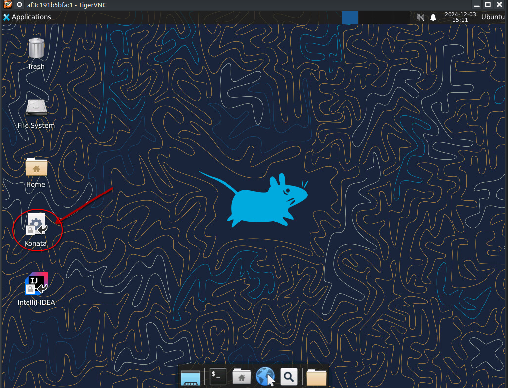

Self Contained Tutorial
=======================

This self contained tutorial will show you how to pull a Docker container with all the
dependencies preinstalled so that you can start right away without having to compile any
of the dependencies from scratch.

Simply pull the Docker image from the Docker hub and get started.

The scope of this tutorial is:

* Fetching the Docker image
* Generating the verilog
* Running a simulation
* Opening the traces (gtkwave + konata)

**Important**

Starting the Docker image might take much longer, when your own user owning the folder
where you cloned the repo to doesn't have the same uid as the ubuntu user inside the
Docker container! The uid of the ubuntu user is 1000

Linux and MacOS X
------------------

There's a bash script called run_docker.sh which automatically pulls the most
recent Docker image, starts it and then launches a VNC viewer.

Just make sure that you have Tiger VNC, bash and of course Docker installed
and that the Docker demon is running.

Then you can simply run

.. code-block:: bash

    ./run_docker.sh

After the image has been fetched and the virtual X server has started you should
be greated with an XFCE4 desktop in a VNC viewer

Windows
-------

Windows is a bit trickier, but similar as what we do on Linux and Mac

In the Power Shell, first fetch the Docker image, then start it as demon and check
with the inspect command what the IP of the container is.

After that, you should be able to connect with a VNC client.

TigerVNC also exists for Windows: https://sourceforge.net/projects/tigervnc

.. code-block:: bash

    docker.exe pull leviathanch/vexiiriscv
    docker.exe run -v `pwd`:/work --privileged=true -idt leviathanch/vexiiriscv

After that, run the inspect command with the container ID docker returns when starting
the image as a demonized process.

.. code-block:: bash

    docker.ext inspect -f '{{range.NetworkSettings.Networks}}{{.IPAddress}}{{end}}' $container_id

Next run the Tiger VNC vncviewer

.. code-block:: bash

    vncviewer.exe $ip

Generating the verilog
----------------------

First open the terminal by clicking the terminal icon as shown below

As soon as you've started the Docker container as shown above you can obtain the Verilog
code by simply running the following command from within the terminal.

Make sure however that you're in the proper folder

.. code-block:: bash

    ~/generate_verilog.sh
    
This script simply contains the following command

.. image:: Screenshot_20241203_165329.png
  :width: 400
  :alt: Generate Command

.. code-block:: bash

    #!/bin/bash
    sbt "Test/runMain vexiiriscv.Generate"

After it has been running through, you should now have a file called "VexiiRiscv.v"
right there in your source folder

.. image:: Screenshot_20241203_152940.png
  :width: 400
  :alt: Generation Result

Running a simulation
--------------------

Running a simulation also is straight forward, in the same shell as you used for generating
the Verilog code.

.. image:: Screenshot_20241203_165608.png
  :width: 400
  :alt: Run simulation

.. code-block:: bash

    ~/run_simulation.sh

This readily available script contains the simple command

.. code-block:: bash

    #!/bin/bash
    sbt "Test/runMain vexiiriscv.tester.TestBench --with-mul --with-div --load-elf ext/NaxSoftware/baremetal/dhrystone/build/rv32ima/dhrystone.elf --trace-all"

This will run through for a moment, and should look like this, finishing without errors

.. image:: Screenshot_20241203_165858.png
  :width: 400
  :alt: Run simulation

Opening the traces with GTKWave
-------------------------------

You can convert the wave file from the simulation into the VCD format and view it by opening
it with GTKWve, which is already installed in the Docker image.

To do so, simply run in the shell

.. code-block:: bash

    gtkwave simWorkspace/VexiiRiscv/test/wave.fst

This will start GTKWave.

.. image:: Screenshot_20241203_170056.png
  :width: 400
  :alt: GTKWave open

Opening the traces with Konata
------------------------------

In order to visualize the instruction pipeline, you may wanna open Konata.
For doing so, click on the Konata icon

Next load the konata log by going into the folder as shown in the picture

.. image:: Screenshot_20241203_151018.png
  :width: 400
  :alt: Load konata log

You should be greated with a colorful representation of the instructions
in the RISC-V pipeline during boot up

.. image:: Screenshot_20241203_151124.png
  :width: 400
  :alt: Pipeline visualization

Opening Intellij IDEA
----------------------

First click onto the Intellij IDEA icon

.. image:: Screenshot_20241203_153149.png
  :width: 400
  :alt: Intellij IDEA: Icon

Accept the terms and conditions

We don't send data

.. image:: Screenshot_20241203_163222.png
  :width: 400
  :alt: Intellij IDEA: No telemetry

Load the VexiiRiscv project

.. image:: Screenshot_20241203_153226.png
  :width: 400
  :alt: Intellij IDEA: New projects

Enter the folder where your cloned repo is mounted to from outside, which is
configured to be /work.

Then press OK

.. image:: Screenshot_20241203_163411.png
  :width: 400
  :alt: Intellij IDEA: Load Project

Confirm that you trust the project

.. image:: Screenshot_20241203_163438.png
  :width: 400
  :alt: Intellij IDEA: Trust project

After that it will take a while until the entire project has been loaded
and indexed. Make a cup of coffee or tea in the meanwhile.

Shutting down the Container
---------------------------

In order to shut down the container, simply logout from XFCE4 which will
make the process stop and the container terminate

.. image:: Screenshot_20241203_153436.png
  :width: 400
  :alt: Logout

Confirm that you wanna log out

  
